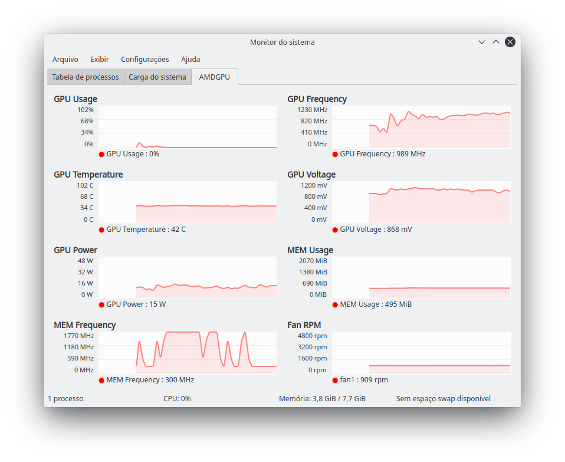

# AMDGPU-Sensors

AMDGPU-Sensors is a daemon that allows non-root applications to read sensor information from AMD cards using the AMDGPU driver - with an optional Ksysguard tab!

# Requirements
* An AMD graphics card using the open source AMDGPU driver
* A systemd distro
* Python 3
* Perl (only for the Ksysguard tab)

To use this tool you need to set up the sensors daemon and use some other tool to read the information it provides. The project includes 2 tools for that: a terminal monitor and a Ksysguard tab.

# The daemon
The daemon is a systemd service that will read sensor info from read-protected files and place it in a more convenient place (`/tmp/amdgpu-sensors/*`), in files that are readable by non-root applications. It updates those files once per second by default. To install it, open a terminal in the project folder and run the install script (`install.sh`). To uninstall it, run the uninstall script (`uninstall.sh`) from the same folder.

# The monitor
Once the daemon is installed and running, open a terminal in the project folder and run the monitor script with Python 3 (`python3 amdgpu-sensors-monitor.py`), it will show all sensors, updating each second. Use CTRL+C to stop the execution.

## The Ksysguard tab
To use the Ksysguard tab you need to install a Perl script that will make the sensors available inside Ksysguard, alongside all other sensors of the system, and the tab file itself, that will use those sensors to display the charts. First, open a terminal in `ksysguard`, in the project root, and install the script using the install script (`install.sh`). This will copy the script `amdgpu-sensors.pl` to the `/etc` folder. Then, just open Ksysguard, click `File` -> `Import tab from file` -> select `AMDGPU.sgrd` inside the same folder.

## Important notes
* I don't have access to different AMD cards to test it so some sensors can go wrong.
* Your distro may do things different than the one I'm using at the moment.
* If the sensors are working fine but you have a different card, you may want to change the chart scales in Ksysguard, as the tab file is calibrated to my card (right click the chart -> scaling -> specify graph interval).
* The Ksysguard tab includes an extra sensor for Fan RPM. I added it mostly to cover the empty chart that would otherwise be annoying, but it is useful anyway.

* I'm using a RX 460 2GB and running Arch Linux.

## [1deterministic](https://github.com/1deterministic), 2019